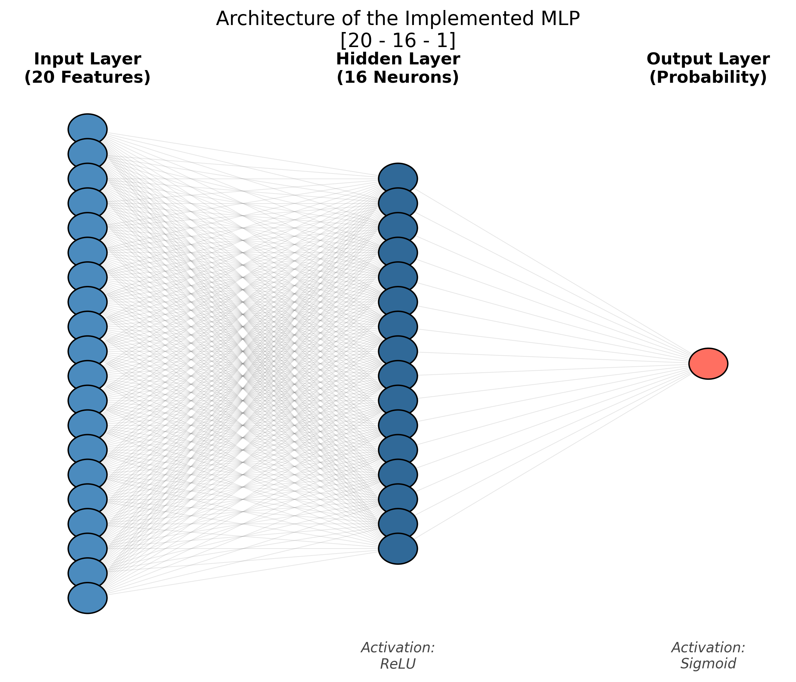
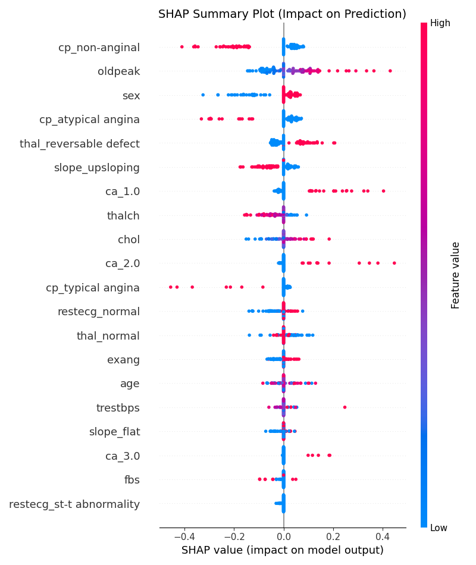

# Heart Disease Prediction via Custom MLP (From-Scratch)


## 📌 Project Overview

This repository hosts a rigorous software engineering project aimed at predicting the presence of heart disease using a **Multilayer Perceptron (MLP)** built entirely from scratch using `NumPy`.

Unlike standard implementations that rely on high-level APIs like Keras or PyTorch, this project implements the mathematical core of deep learning (Matrix multiplication, Backpropagation, Gradient Descent optimization) manually. The goal was to engineer a model that is statistically robust, medically interpretable, and competitive against production-grade libraries.

**Key Achievement:** The custom model achieved a **Recall of 88.17%**, significantly outperforming the Scikit-Learn library implementation (78.49%) on the same test set, making it a safer tool for medical screening.

---

## 📂 Dataset

The project utilizes the **Combined UCI Heart Disease Dataset**, merging four databases to create a more challenging and realistic scenario than the standard subset:
* **Sources:** Cleveland, Hungary, Switzerland, and Long Beach V.A.
* **Samples:** 853 (after preprocessing and imputation).
* **Features:** 20 (after One-Hot Encoding and Standardization).
* **Target:** Binary Classification (0: Healthy, 1: Heart Disease).

---

## 🧠 Architecture & Methodology

### The "From-Scratch" Engine
The core logic resides in `src/mlp_model.py`.
* **Architecture:** `[Input: 20] -> [Hidden: 16, ReLU] -> [Output: 1, Sigmoid]`
* **Optimizer:** Mini-Batch Stochastic Gradient Descent (SGD).
* **Loss Function:** Binary Cross-Entropy (Log Loss).
* **Initialization:** Gaussian distribution ($\mu=0, \sigma=0.01$).


*(Generated via `src/generate_diagram.py`)*

### Meta-Optimization Strategy
We treated hyperparameter tuning as a meta-learning problem, using **Stratified 5-Fold Cross-Validation** to optimize the architecture and learning rate before the final evaluation.
* **Optimal Config:** Learning Rate `0.005`, Epochs `2500`, Hidden Neurons `16`.

---

## 📊 Experimental Results

We benchmarked our manual implementation against a standard `sklearn.neural_network.MLPClassifier` (optimized with Adam).

| Metric | Our MLP (From Scratch) | Scikit-Learn (Library) | Improvement |
| :--- | :---: | :---: | :---: |
| **Accuracy** | **80.70%** | 76.61% | +4.09% |
| **Recall (Sensitivity)** | **88.17%** | 78.49% | **+9.68%** |
| **F1-Score** | **83.25%** | 78.49% | +4.76% |
| **AUC-ROC** | **87.14%** | 84.64% | +2.50% |

> **Medical Note:** The superior Recall of our model implies significantly fewer False Negatives, which is critical in medical diagnostics to prevent missing sick patients.

### Statistical Robustness
Using 5-Fold Cross-Validation, we established the statistical stability of the model:
* **Accuracy CI (95%):** $80.66\% \pm 1.83\%$
* **Recall CI (95%):** $82.32\% \pm 4.32\%$

---

## 🔍 Model Interpretability (XAI)

To ensure the model isn't a "Black Box", we applied **SHAP (SHapley Additive exPlanations)**.

### Key Insights
* **ST Depression (`oldpeak`):** Identified as a top risk factor. High values (Red) push the prediction towards disease.
* **Max Heart Rate (`thalach`):** Correctly identified as inversely related to risk (higher capacity = healthier heart).



---

## 🚀 How to Run

1.  **Clone the repository:**
    ```bash
    git clone [https://github.com/YOUR_USERNAME/Heart-Disease-MLP-From-Scratch.git](https://github.com/YOUR_USERNAME/Heart-Disease-MLP-From-Scratch.git)
    cd Heart-Disease-MLP-From-Scratch
    ```

2.  **Install requirements:**
    ```bash
    pip install -r requirements.txt
    ```

3.  **Train and Evaluate:**
    * To run the single final evaluation:
        ```bash
        python src/final_evaluation.py
        ```
    * To run the rigorous statistical analysis (K-Fold + SHAP):
        ```bash
        python src/advanced_analysis.py
        ```

---

## 📚 Documentation

Detailed documentation of each phase of the project is available in the `docs/` folder:
1.  [Project Specification](docs/Comp1_Software_Project_Specification_ML.pdf)
2.  [Data Analysis & Features](docs/Comp2_Data_Analysis_Heart_Disease_MLP.pdf)
3.  [ML Technique & Formal Design](docs/Comp3_ML_Technique_Spec.pdf)
4.  [State of the Art Review](docs/Comp4_Related_Work_Summary_ML.pdf)
5.  [Final Results & Discussion](docs/Comp5_Results_&_Discussion.pdf)

---

## 👨‍💻 Author

**Juan Manuel Ruiz Llamas**
* *Project developed as part of the Machine Learning Course at Babes-Bolyai University.*
* *Methodology:* Waterfall / Component-based Engineering.

---

## 📄 License

This project is licensed under the MIT License - see the LICENSE file for details.
